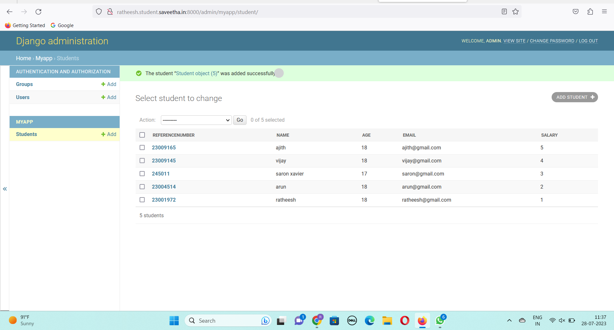

# Django ORM Web Application

## AIM
To develop a Django application to store and retrieve data from a database using Object Relational Mapping(ORM).

## Entity Relationship Diagram

Include your ER diagram here

## DESIGN STEPS

### STEP 1:
clone the repository from github

### STEP 2:
create an admin interface for django

### STEP 3:
create an app and edit settings.py


## PROGRAM
```
admin.py

from django.contrib import admin
from django.contrib import admin
from .models import Student,StudentAdmin
admin.site.register(Student,StudentAdmin)

models.py

from django.db import models
from django.db import models
from django.contrib import admin

class Student (models.Model):

    referencenumber=models.CharField(max_length=20,help_text="reference number")

    name=models.CharField(max_length=100)

    age=models.IntegerField()

    email=models.EmailField()

    salary=models.IntegerField()


class StudentAdmin(admin.ModelAdmin):

    list_display=('referencenumber','name','age','email','salary')

## OUTPUT



## RESULT
The project for creating a database of 5 employees using ORM executed successfully
